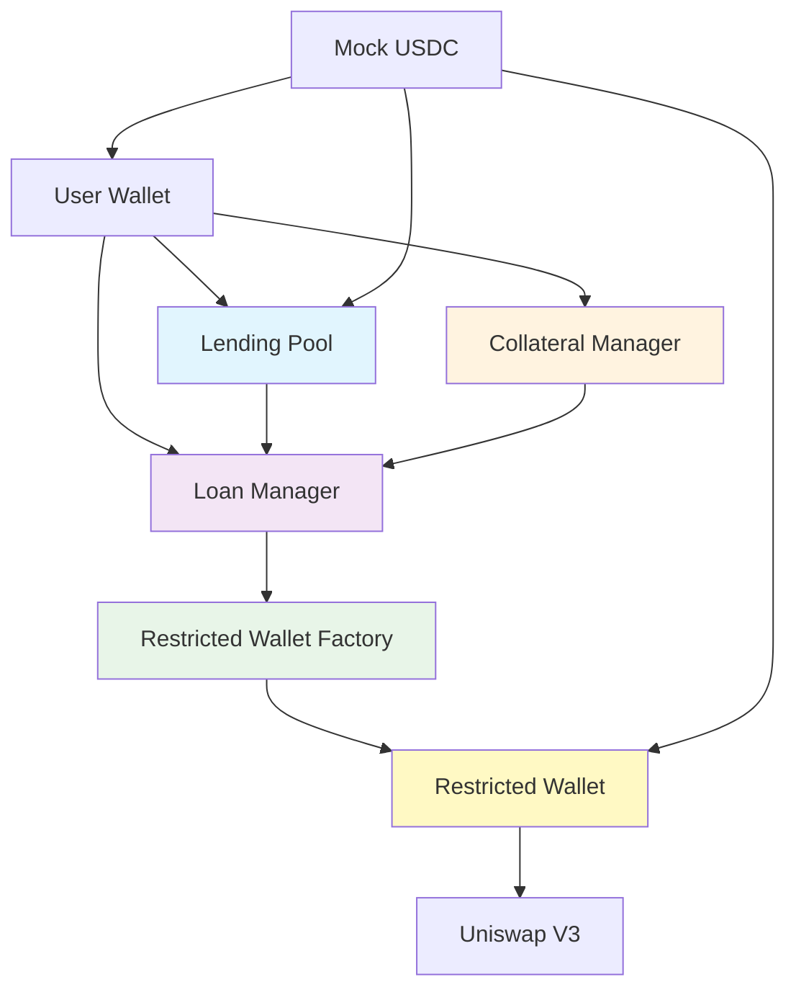

# Smart Contracts

Invalend Protocol is built on a suite of smart contracts deployed on **Lisk Sepolia Testnet**. All contracts are verified and can be viewed on the Lisk Sepolia Blockscout explorer.

## Network Information

- **Chain**: Lisk Sepolia Testnet
- **Chain ID**: 4202
- **Native Token**: ETH (for gas fees)
- **Block Explorer**: [Lisk Sepolia Blockscout](https://sepolia-blockscout.lisk.com)
- **RPC Endpoint**: https://rpc.sepolia-api.lisk.com

## Contract Addresses

### Core Protocol Contracts

#### 1. **Lending Pool Contract**
The main contract that manages USDC deposits and handles yield distribution.

- **Address**: [`0x752168dd102d1c4b9390ab6abf3ec39f2164ad11`](https://sepolia-blockscout.lisk.com/address/0x752168dd102d1c4b9390ab6abf3ec39f2164ad11)
- **Functions**: Deposit, Withdraw, Yield Distribution, Pool Statistics
- **Key Features**:
  - 6% APY for depositors
  - Automated yield calculations
  - Liquidity pool management
  - User balance tracking

#### 2. **Loan Manager Contract**
Manages loan creation, collateral requirements, and liquidations.

- **Address**: [`0x8c0694Ff8df07554C5a4b2D83992e1987733Ba64`](https://sepolia-blockscout.lisk.com/address/0x8c0694Ff8df07554C5a4b2D83992e1987733Ba64)
- **Functions**: Create Loans, Manage Collateral, Handle Liquidations
- **Key Features**:
  - 20% collateral requirement
  - 5x maximum leverage
  - 30-day loan terms
  - Automated liquidation protection

#### 3. **Collateral Manager Contract**
Handles collateral deposits, calculations, and risk management.

- **Address**: [`0x23c369a4991a477e4b9dd13f179b2e68203abc1d`](https://sepolia-blockscout.lisk.com/address/0x23c369a4991a477e4b9dd13f179b2e68203abc1d)
- **Functions**: Collateral Validation, Risk Assessment, Position Monitoring
- **Key Features**:
  - Real-time collateral valuation
  - Health factor calculations
  - Liquidation threshold monitoring
  - Multi-asset collateral support

#### 4. **Restricted Wallet Factory**
Creates and manages restricted smart contract wallets for secure trading.

- **Address**: [`0x7364eeb345989c757616988b70976bba163b7571`](https://sepolia-blockscout.lisk.com/address/0x7364eeb345989c757616988b70976bba163b7571)
- **Functions**: Create Restricted Wallets, Manage Permissions, Access Control
- **Key Features**:
  - Whitelisted function calls only
  - Uniswap V3 integration
  - Automated security enforcement
  - Owner-controlled operations

### Token Contracts

#### 5. **Mock USDC Token**
Test USDC token for Lisk Sepolia testnet operations.

- **Address**: [`0xe61995e2728bd2d2b1abd9e089213b542db7916a`](https://sepolia-blockscout.lisk.com/address/0xe61995e2728bd2d2b1abd9e089213b542db7916a)
- **Symbol**: USDC
- **Decimals**: 6
- **Functions**: Transfer, Approve, Mint (testnet only)
- **Key Features**:
  - ERC-20 compatible
  - Testnet faucet functionality
  - Standard USDC behavior
  - Gas-efficient operations

## Contract Architecture



## Security Features

### Access Control
- **Owner-only functions**: Critical operations protected by ownership checks
- **Role-based permissions**: Different access levels for different operations
- **Time locks**: Important changes require time delays
- **Emergency pause**: Ability to halt operations in emergencies

### Safety Mechanisms
- **Reentrancy protection**: Guards against reentrancy attacks
- **Overflow protection**: Safe math operations throughout
- **Input validation**: Comprehensive parameter checking
- **Rate limiting**: Protection against spam and abuse

### Audit Status
- **Internal review**: ✅ Completed
- **External audit**: 🔄 In progress
- **Bug bounty**: 📋 Planned
- **Formal verification**: 📋 Planned

## Integration Guide

### Adding Contracts to Your Wallet

You can add these contracts to your wallet for easy interaction:

1. **Lisk Sepolia Network**:
   ```
   Network Name: Lisk Sepolia
   RPC URL: https://rpc.sepolia-api.lisk.com
   Chain ID: 4202
   Currency Symbol: ETH
   Block Explorer: https://sepolia-blockscout.lisk.com
   ```

2. **Add USDC Token**:
   ```
   Token Address: 0xe61995e2728bd2d2b1abd9e089213b542db7916a
   Token Symbol: USDC
   Token Decimals: 6
   ```

### Interacting with Contracts

#### Using Web3 Libraries

```javascript
// Example with ethers.js
import { ethers } from 'ethers';

const provider = new ethers.providers.JsonRpcProvider('https://rpc.sepolia-api.lisk.com');
const lendingPoolAddress = '0x752168dd102d1c4b9390ab6abf3ec39f2164ad11';

// Initialize contract
const lendingPool = new ethers.Contract(lendingPoolAddress, LENDING_POOL_ABI, provider);

// Read pool stats
const totalDeposits = await lendingPool.totalDeposits();
```

#### Using wagmi Hooks (React)

```typescript
// Example with wagmi
import { useReadContract } from 'wagmi';
import { LENDING_POOL_ABI } from '@/abis/lending-pool-abi';

export function PoolStats() {
  const { data: totalDeposits } = useReadContract({
    address: '0x752168dd102d1c4b9390ab6abf3ec39f2164ad11',
    abi: LENDING_POOL_ABI,
    functionName: 'totalDeposits',
  });

  return <div>Total Deposits: {totalDeposits?.toString()}</div>;
}
```

## Deployment Information

### Deployment Sequence
1. **Mock USDC** - Base token for the ecosystem
2. **Lending Pool** - Core deposit/lending functionality
3. **Collateral Manager** - Risk management system
4. **Loan Manager** - Loan lifecycle management
5. **Restricted Wallet Factory** - Secure wallet creation

### Verification Status
All contracts are verified on Lisk Sepolia Blockscout and their source code is publicly available.

## Support & Resources

### Developer Resources
- **GitHub Repository**: [Invalend Protocol](https://github.com/Invalend)
- **Documentation**: [docs.invalend.com](/)
- **API Reference**: [API Documentation](/docs/api)

### Community
- **Discord**: [Join Community](https://discord.gg/invalend)
- **Twitter**: [@InvalendProtocol](https://twitter.com/invalend)
- **Blog**: [Medium Blog](https://medium.com/@invalend)

### Support
- **Bug Reports**: [GitHub Issues](https://github.com/Invalend/frontend/issues)
- **Feature Requests**: [GitHub Discussions](https://github.com/Invalend/frontend/discussions)
- **Security Issues**: security@invalend.com

---

*All contract addresses are for Lisk Sepolia testnet. Always verify addresses before interacting with contracts.*
