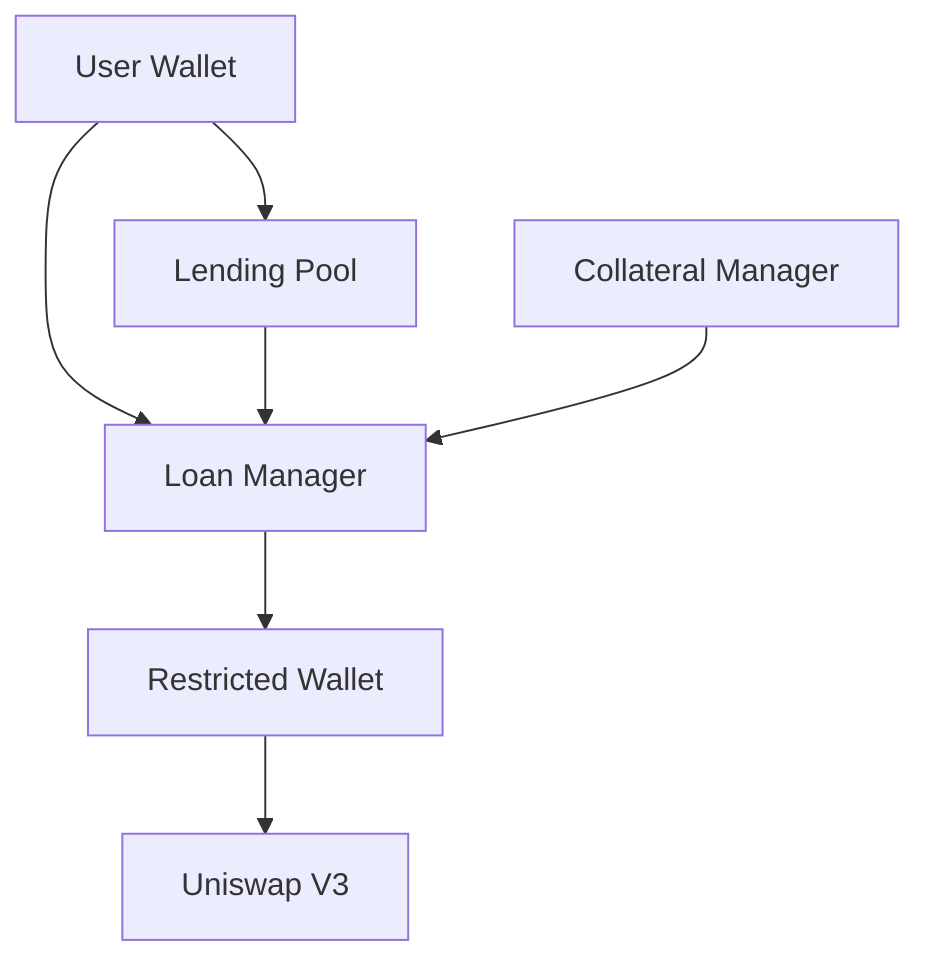

# Introduction to Invalend Protocol

Invalend is a decentralized finance (DeFi) protocol that provides leveraged trading capabilities through an innovative lending and borrowing system. Built and deployed on Lisk Sepolia testnet, Invalend combines traditional lending pools with advanced trading mechanisms.

## What is Invalend?

Invalend enables users to:

- **Earn passive income** by depositing USDC into lending pools
- **Borrow funds** with 20% collateral requirement for leveraged trading  
- **Trade with leverage** up to 5x using Uniswap V3 integration
- **Manage positions** through secure restricted wallets

## Key Features

### 🏦 Lending Pool
- Deposit USDC and earn **6% APY**
- Automated yield generation
- Instant withdrawals (when funds available)
- Pool statistics and analytics

### 💰 Leveraged Borrowing  
- Borrow up to 5x your collateral
- 20% margin requirement
- Automated liquidation protection

### 📈 Integrated Trading
- Direct Uniswap V3 integration
- Secure restricted wallet system
- Real-time position monitoring
- Slippage protection

### 🔒 Security First
- Restricted wallet architecture
- Whitelisted functions and tokens
- Multi-layered security model
- Audited smart contracts

## How It Works

### 1. Deposit & Earn
Users deposit USDC into the lending pool and automatically earn yield from borrowing fees and protocol revenue.

### 2. Borrow & Trade  
Traders can borrow USDC with minimal collateral (20%) and use these funds for leveraged trading positions.

### 3. Pool Funding
The lending pool provides 80% of loan funding, while borrowers provide 20% as collateral, creating a capital-efficient system.

### 4. Automated Management
Smart contracts handle loan creation, position monitoring, and liquidations automatically.

## Architecture Overview

## Getting Started

1. **Connect your wallet** to the Invalend dApp
2. **Get test USDC** from the faucet (testnet only)
3. **Choose your strategy**:
   - Deposit USDC to earn yield
   - Borrow and trade for leveraged positions
4. **Monitor your positions** through the dashboard

## Network Information

- **Chain**: Lisk Sepolia Testnet
- **Native Token**: ETH (for gas)
- **Primary Asset**: USDC
- **Block Explorer**: [Lisk Sepolia Blockscout](https://sepolia-blockscout.lisk.com)

## Next Steps

- [Quick Start Guide](/docs/quick-start) - Get up and running in 5 minutes
- [Dashboard Overview](/docs/dashboard) - Understand the main interface  
- [Deposit & Earn Guide](/docs/guides/deposit-earn) - Start earning yield
- [Trading Guide](/docs/guides/trading) - Learn leveraged trading

---

*Ready to get started? Check out our [Quick Start Guide](/docs/quick-start) or explore the [Dashboard](/docs/dashboard) documentation.*
